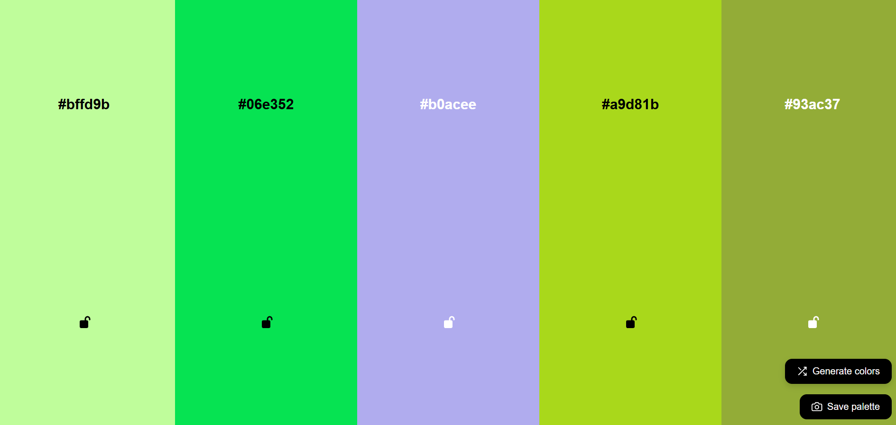
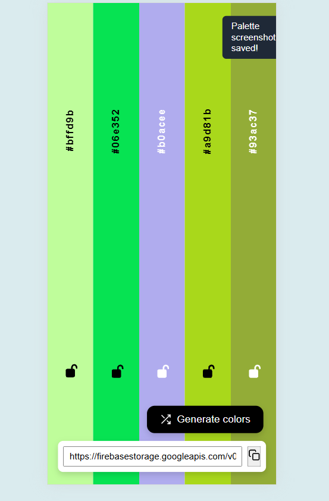

# 🎨 Color Selection

A modern **color palette generator** built with **Vite, React, TypeScript, and Firebase**.  
Generate random color palettes, lock favorite colors, copy HEX codes, and save palette screenshots to the cloud.

### 🔗 Live Demo
👉 https://color-selection-vm.web.app
---

## ✨ Features

- 🎨 Generate random color palettes
- 🔒 Lock colors to keep them during regeneration
- ⌨️ Generate colors using the **Space** key
- 📋 Copy HEX color codes to clipboard
- 📸 Save palette as an image
- ☁️ Upload palette screenshots to **Firebase Storage**
- 🔗 Get a shareable image URL
- 📱 Fully responsive layout

---

## 🛠 Tech Stack

- **Frontend:** React, TypeScript, Vite
- **Color utils:** chroma-js
- **Screenshots:** html2canvas
- **Cloud Storage:** Firebase Storage
- **Icons:** react-icons (Feather)
- **Styling:** CSS

---

## 📸 Screenshots

### Desktop View



### Mobile View



---

## 🚀 Getting Started

### Install & Run Locally

```bash
npm install
npm run dev
```